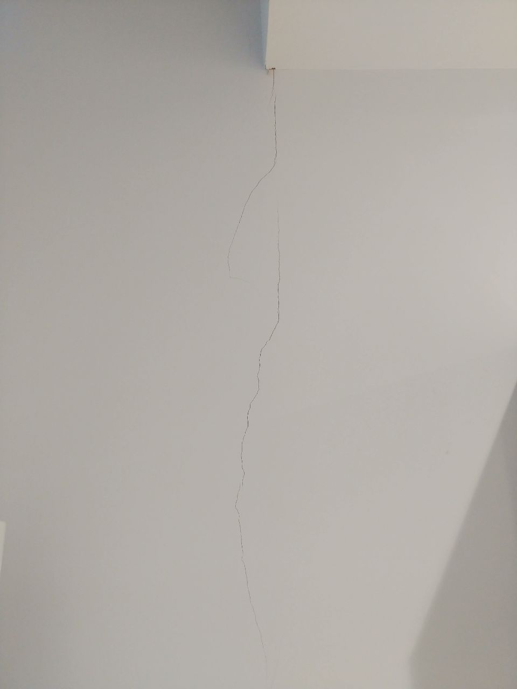
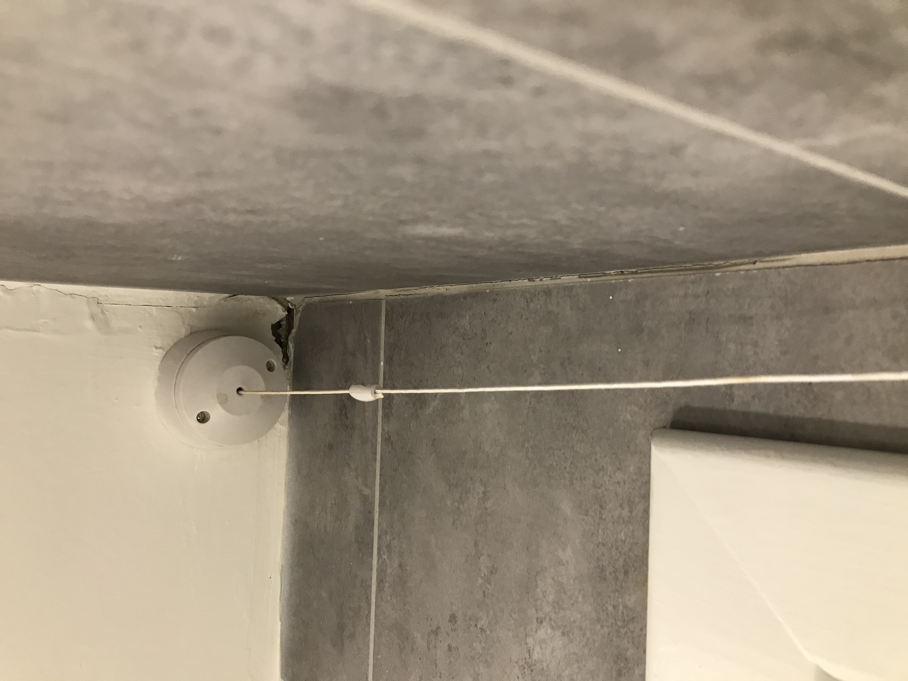
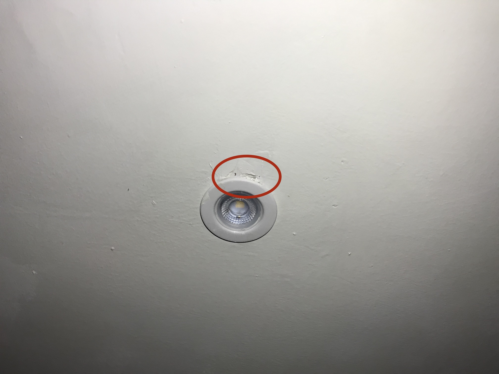
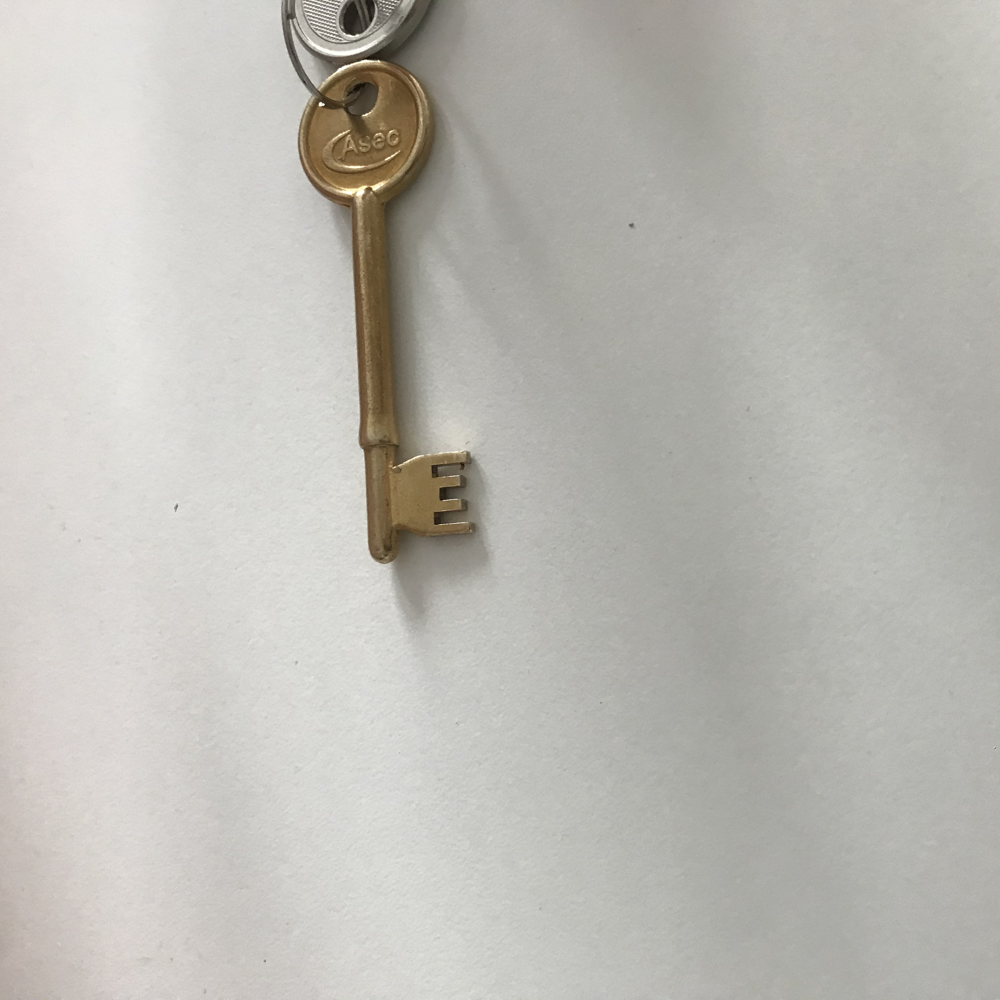
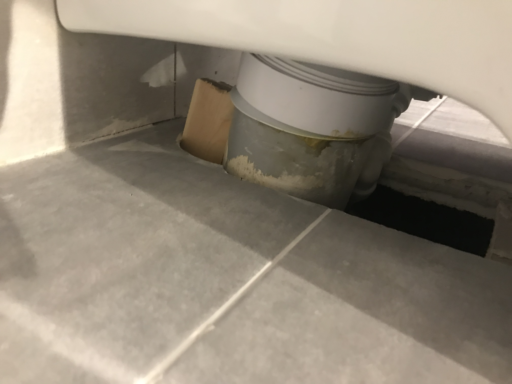
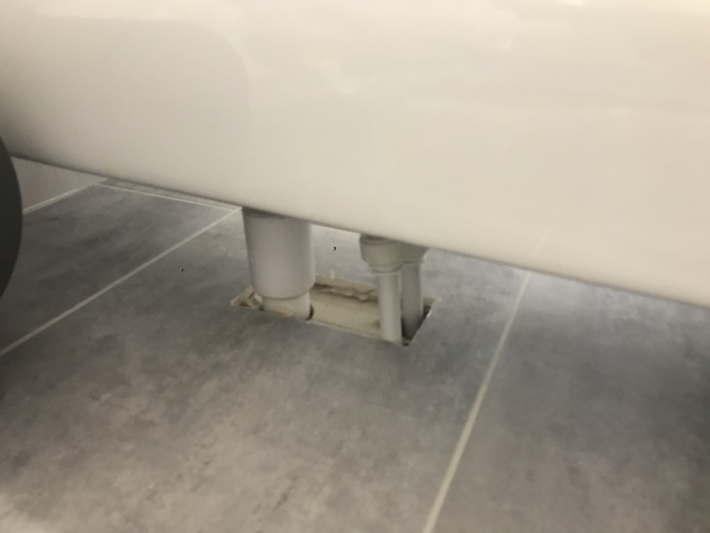

# Just flat things

This is a list of things that are broken or were not functioning when I moved in.

## The wall in the living room is cracking

## The boiler makes a loud noise every couple minutes

https://youtu.be/Ksho52Nt5sU

## The bathroom sink doesn't work well

The sink doesnt drain as fast as the water fills up. This problem does not occur in the kitchen. This occurs even with the sink open.

https://youtu.be/PCZm0p-bYYU

https://youtu.be/3nqwHUxwSO0

## The ceiling in the bathroom is cracked

## The door lock seem unsafe

This is not broken, but the lock on the door is inconvenient for 3 reasons:

- It looks very unsafe and easy to pick
- It prevents the door from closing automatically
- It cannot be open from the inside without the key

## The fan in the bathroom does not work

https://youtu.be/Ql1X__oRiL0

## The tiles in the bathroom leave holes through the walls

Isn't this a problem with humidity sipping into the walls?

